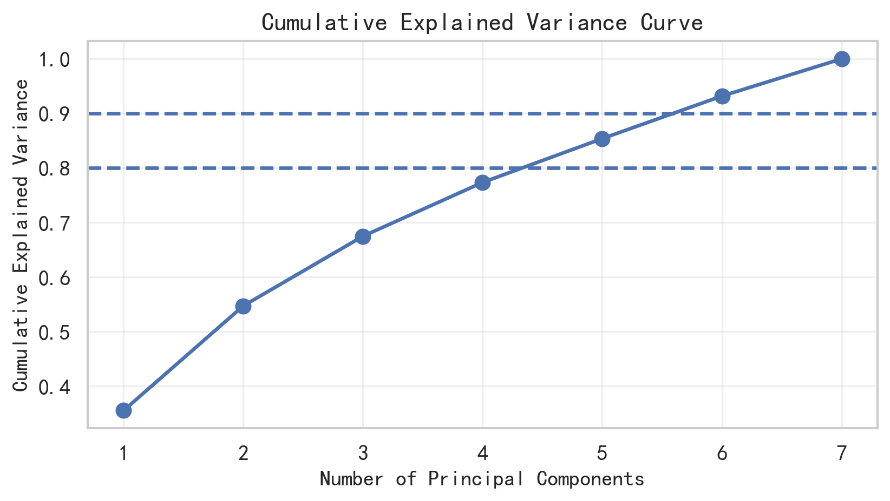
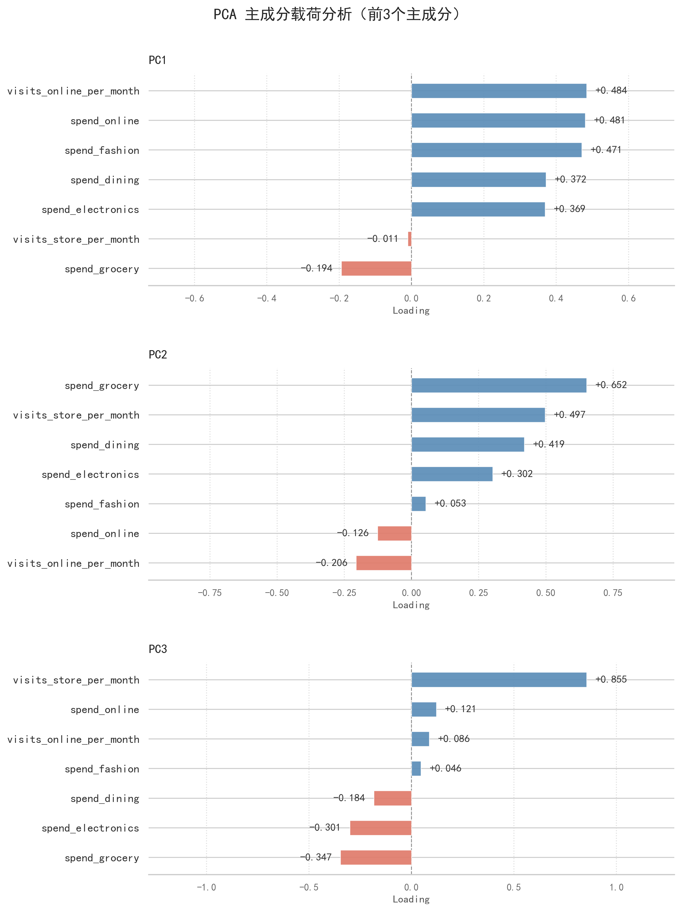
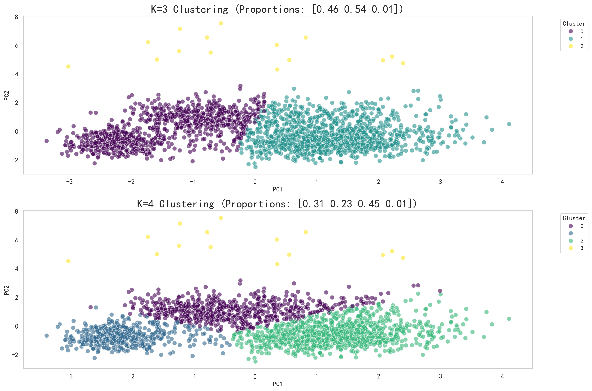
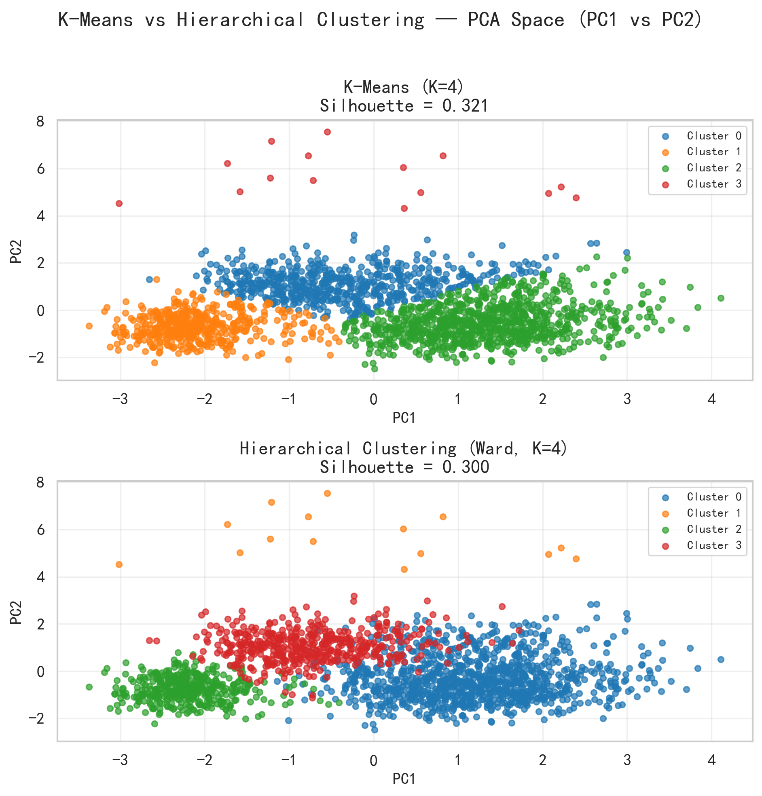
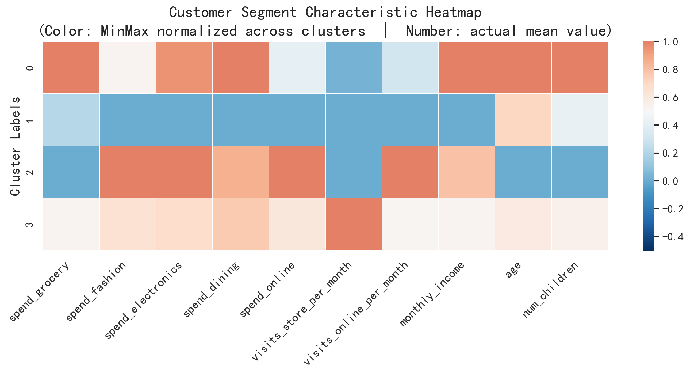

# 零售集团消费者细分与客户画像

**Retail Customer Segmentation & Profiling (PCA + K-Means + Hierarchical Clustering)**

基于 2000 位零售顾客的消费与访问行为数据，使用 **PCA 降维 + K-Means 聚类**把顾客分成 4 类，对比层次聚类，构建客户画像，并给出差异化营销建议。

 

---

## 1. 项目背景与目标

零售集团希望识别不同顾客群体在**消费结构、购物偏好、渠道偏好**上的差异，以便：

- 为不同客群设计差异化促销，提升转化率、降低发券成本；
- 结合忠诚度评分识别客户价值，优化会员分级；
- 根据线上/线下偏好分配渠道资源。

业务上希望得到 **3–5 类**客群：既能体现差异，又不会让营销执行过于复杂。

## 2. 数据

| 项目 | 说明 |
|---|---|
| 样本量 | 2000 位顾客，15 个字段 |
| 数据来源 | 课程提供的数据集 |
| 缺失值 | `monthly_income`、`num_children`、`spend_electronics`、`spend_online` 共约 2.5% 缺失，用中位数填充 |

| 用途 | 字段 |
|---|---|
| **聚类输入**（行为变量） | `spend_grocery`、`spend_fashion`、`spend_electronics`、`spend_dining`、`spend_online`、`visits_store_per_month`、`visits_online_per_month` |
| **仅用于画像**（不参与聚类） | `age`、`gender`、`marital_status`、`education_level`、`monthly_income`、`num_children` |
| **业务验证** | `loyalty_score`（由消费额和访问次数衍生，用来检验分群是否有业务意义） |
| 剔除 | `customer_id` |

> 本仓库**不包含原始数据**，运行方式见第 8 节。

## 3. 分析流程

```
数据预处理 → PCA 降维（PC3 vs PC5）→ K-Means（K=2~18 多指标评估）→ 选定 K=4
          → 层次聚类（Ward）对比 → 客户画像 → 营销建议
```

| 步骤 | 做法 |
|---|---|
| 预处理 | 中位数填充缺失值；StandardScaler 标准化，避免量纲差异主导距离计算 |
| 降维 | 比较 PC3 与 PC5 的累计解释方差、轮廓系数、MSE，选择 PC5 |
| K-Means | 对 K=2~18 计算 Inertia、Silhouette、CHI、DBI 与子采样稳定性（ARI） |
| 层次聚类 | Ward 最小方差法，用树状图、Silhouette、CHI、DBI、稳定性、Cophenetic 相关系数等评估 |
| 方法对比 | 从聚类指标、簇结构、规模、业务可解释性综合比较 |

**工具**：Python（pandas、numpy、scikit-learn、scipy、matplotlib、seaborn）

## 4. 关键决策与结果

### 4.1 为什么选 PC5 而不是 PC3

| 主成分个数 | 累计解释方差 | 轮廓系数 | MSE |
|---|---|---|---|
| PC3 | 67.49% | 0.4475 | 0.3251 |
| **PC5** | **85.38%** | 0.3212 | **0.1462** |

PC3 轮廓系数更高，但丢失约三分之一信息；PC5 保留 85% 以上信息，轮廓系数仍在可接受范围，兼顾信息完整性与聚类效果。



前三个主成分的含义：

- **PC1**：线上访问频繁、线上/时尚/餐饮消费高的活跃消费者
- **PC2**：频繁到店、偏好杂货和线下餐饮的传统消费者
- **PC3**：到店频次极高（载荷 +0.855）、消费金额偏低的特殊模式



### 4.2 为什么选 K=4

Silhouette 与 DBI 在 K=3 最优，CHI 在 K=4 达到峰值，稳定性在 K=3~4 都较高。综合指标后候选为 K=3 或 K=4，最终选 **K=4**，原因是：

- K=3 时主体客户只被分成“低消费线下”和“高消费线上”两类，过于粗糙，中间交界人群区分不够；
- K=4 把主体客户拆成 3 个规模合理、特征鲜明的群体，可直接对应不同运营策略。



### 4.3 K-Means vs 层次聚类

| 指标 | K-Means (K=4) | Hierarchical (K=4) |
|---|---|---|
| Silhouette | **0.3212** | 0.3001 |
| CHI | **938.46** | 847.29 |
| DBI（越低越好） | 0.9370 | 0.9676 |
| 各簇规模 | 628 / 466 / 891 / 15 | 1076 / 15 / 415 / 494 |
| 业务可解释性 | 四簇特征明显 | 主体三簇边界模糊，难以命名 |

K-Means 在三项指标上都略优，簇规模更均衡、边界更清晰，因此作为最终方案。



## 5. 客户画像

| 簇 | 占比 | 画像 | 特征 |
|---|---|---|---|
| **Cluster 2** | 44.6% | 年轻时尚线上全能消费者 | 最年轻、未婚比例最高；除杂货外多品类高消费；重度线上用户；忠诚度最高，价值最高 |
| **Cluster 0** | 31.4% | 高收入线下生活品消费群体 | 中年、高收入、已婚已育；消费集中在杂货和餐饮；偏线下；时尚与线上消费潜力未释放 |
| **Cluster 1** | 23.3% | 低收入低活跃沉默群体 | 收入有限、线上线下均不活跃、忠诚度最低；流失风险最高 |
| **Cluster 3** | 0.8%（15人） | 极端到店异常客群 | 月到店约 100 次（其他群体的 17–35 倍），其余指标中等；疑似企业采购/供应商或数据异常，建议人工核查 |



## 6. 营销建议

| 客群 | 策略 |
|---|---|
| Cluster 2 | 防流失：按季度消费额或访问次数做会员分级，配专属权益；跨品类捆绑提升客单价；设置到店优享日，引导线上客户向全渠道转化 |
| Cluster 0 | 释放潜力：以杂货、餐饮为锚点，用组合礼包撬动时尚和电子品类；用线上首购激励培养线上习惯 |
| Cluster 1 | 低成本激活：对长期未消费用户推送无门槛券或超低价商品，以最小成本促成首次消费 |
| Cluster 3 | 不纳入常规营销，先人工核查数据真实性 |

## 7. 局限与改进方向

- **异常值处理**：15 位极端到店客户单独成簇，如果是数据错误，会影响聚类准确性。改进：预处理阶段加入 IQR 等异常值处理，再重新聚类。
- **类别特征未参与聚类**：性别、婚姻、学历等只用于画像，当前分群只反映消费行为差异。改进：对类别特征编码后纳入聚类，做行为与人口特征的组合分析。
- **主成分个数选取**：目前只比较了 PC3 和 PC5，可从更多角度验证。
- **聚类结构强度一般**：轮廓系数约 0.32，说明簇之间有一定重叠，分群结果更适合作为营销分层的参考，而不是严格的类别划分。

## 8. 仓库结构与运行方法

```
├── README.md
├── code.ipynb        # 完整分析代码
└── images/           # 输出图表
```

**运行步骤**

1. 克隆仓库并安装依赖：
   ```bash
   git clone https://github.com/w15034923897-cyber/retail-sales-analysis.git
   cd retail-sales-analysis
   pip install pandas numpy scipy scikit-learn matplotlib seaborn jupyter
   ```
2. 准备数据：因版权原因，原始数据未上传。请准备一份 CSV 文件，包含以下字段：
   `customer_id, gender, age, marital_status, education_level, monthly_income, num_children, spend_grocery, spend_fashion, spend_electronics, spend_dining, spend_online, visits_store_per_month, visits_online_per_month, loyalty_score`
3. 在 `code.ipynb` 中将数据文件路径变量 `fileName` 改为你的文件路径，按顺序运行即可。

> Notebook 中已保留各步骤的运行结果，不运行也可以直接查看。

## 9. 说明

本项目为课程项目，仅用于学习与展示分析方法。

**联系方式**：wangran002@suss.edu.sg ｜ 【LinkedIn / 个人主页】
